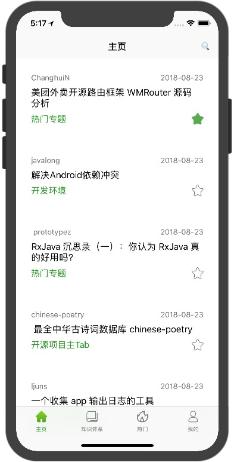
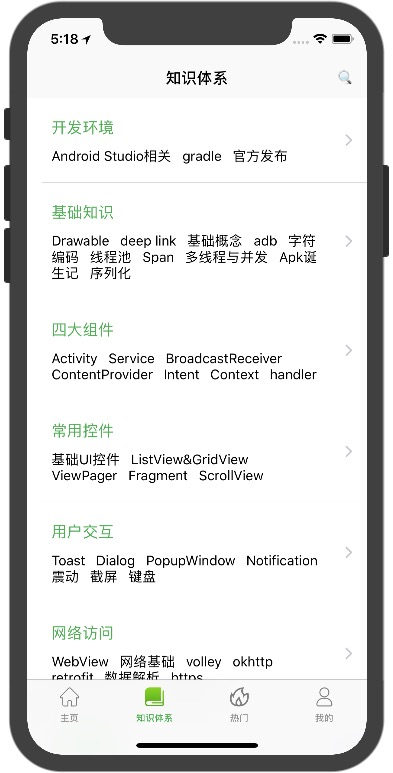
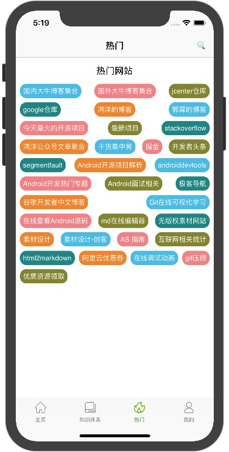
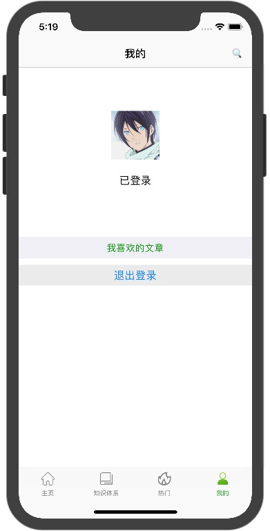
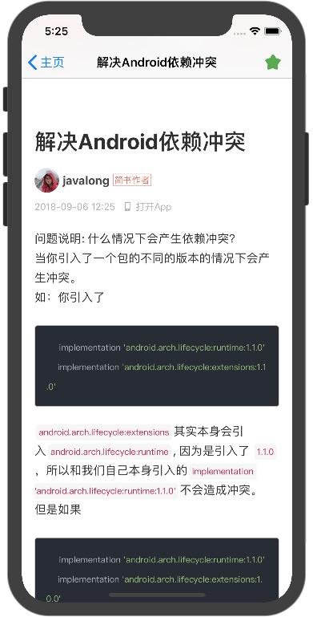
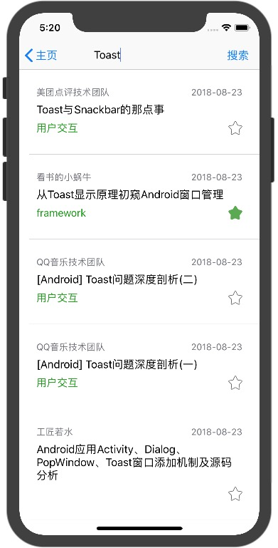
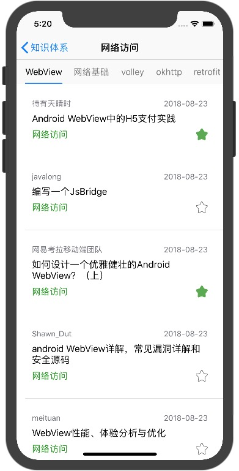

# WanAndroid-iOS-APP
Swift版本的WanAndroidApp

最近项目组原因在学习iOS开发，这是在学习过程中写的demo，学习过程中写的代码可能不怎么规范，作为自己学习过程的记录，见谅，后期如果iOS学习没中断的话会完善和优化。

项目接口基于[Wan Android](http://www.wanandroid.com/index)提供的api来完成的，感谢鸿阳大神。

### 之前写的Flutter版本的WanAndroidApp
之前有时间的时候学习flutter也写了一个WanAndroid的demo，自己也在使用(喜欢的话欢迎各位大佬点个星星)。
[Flutter版本的WanAndroidApp](https://github.com/ywp0919/wan_android_flutter)

### 使用的第三方框架
pod 'Alamofire', '~> 4.7'
pod 'SnapKit', '~> 4.0.0'
pod 'Tabman', '~> 1.0'

### 已完成的Wan Android Api和项目功能
 - 用户登录注册
 - 首页文章列表
 - 知识体系
 - 知识体系下的文章
 - 收藏文章管理
 - 搜索文章
 - 热门网站

## 预览图片

